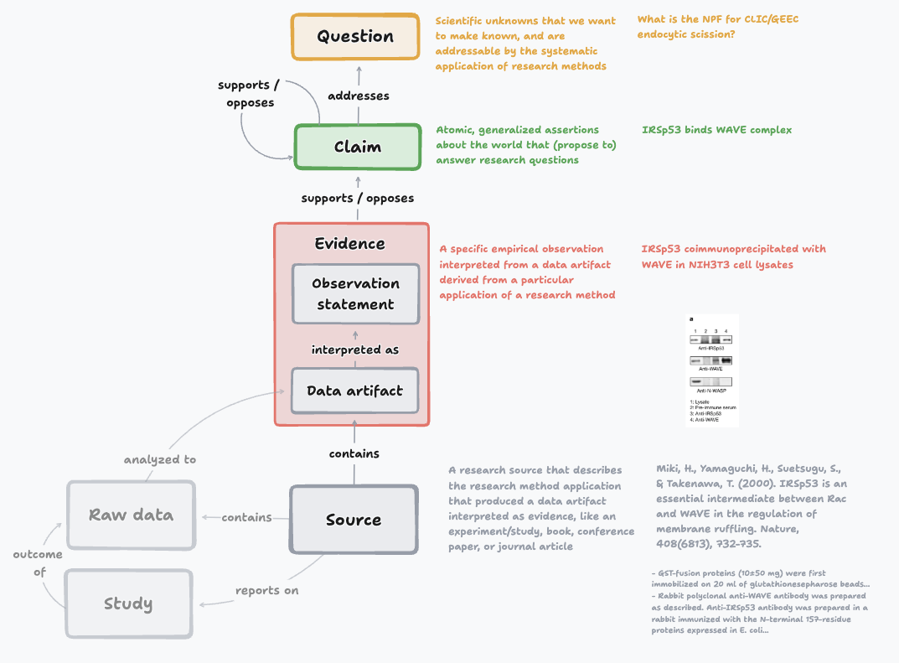

# Discourse Graphs: A Schema for Structured Scientific Knowledge

This repository defines the **Discourse Graphs** schema — a minimal, interoperable data model for representing scientific research as interconnected knowledge components rather than monolithic documents.

## Core Schema

The base schema has **4 node types** and **4 relation types**:

| Node         | Description                                                  |
|--------------|--------------------------------------------------------------|
| **Question** | Scientific unknowns addressable by research methods          |
| **Claim**    | Atomic, generalized assertions that answer research questions |
| **Evidence** | Specific empirical observations from a particular application of a research method |
| **Source**   | Research materials that generate evidence (experiments, studies, articles) |

| Relation                     | Description                              |
|------------------------------|------------------------------------------|
| **Supports / Opposed By**    | Evidence supports or contradicts a claim |
| **Opposes / Supported By**   | (inverse of the above)                   |
| **Addresses / Addressed By** | Claim answers a question                 |
| **Informs**                  | Contextual relevance between nodes       |

Claims and evidence are deliberately separated as first-class types. Relations are reified — each is its own assertion with authorship, provenance, and timestamps.

The full conceptual specification, including design rationale, common variations (lab, HCI, UX research), and prior art, is in [**conceptual-schema-draft.md**](conceptual-schema-draft.md).

## Formal Schemas

### OWL/RDF

[**owl/dg_core.ttl**](owl/dg_core.ttl) and [**owl/dg_base.ttl**](owl/dg_base.ttl) define the base schema as a Web Ontology Language specification. 

### ATProto Lexicon

[**atproto-lexicon/**](atproto-lexicon/) defines a prototype ATProto Lexicon (`org.discoursegraphs.*`) mapping the base schema to federated ATProto records. Design highlights:

- **Reified relations** as separate records with own authorship, provenance, and timestamps
- **Incremental formalization** via optional fields — nodes start as plain text, gain structure over time
- **Open `knownValues`** (not closed enums) so communities can extend without schema migration
- **`localLabel`** mapping lets communities use their own terminology while preserving interoperability

See the [ATProto lexicon README](atproto-lexicon/README.md) for full design decisions, worked examples, and open questions.

### JSON-LD

Example usage: [MATSUlab issue-exchange analysis](https://github.com/DiscourseGraphs/MATSUlab-issue-exchange-analysis). Useful for MCP servers and interoperation between ATProto and the semantic web (e.g., nanopublications).

## Design Principles

- **Minimal shared schema** — define only what is needed for interoperability across tools
- **Incremental formalization** — nodes are born with minimal required formality, progressively refined
- **Local labels, shared types** — communities use their own terminology, mapped to base types for federation
- **Reified relations** — relations are separate assertions with their own metadata, not node attributes
- **Composable** — nodes are modular units that maintain provenance when combined

See https://arxiv.org/abs/2407.20666 for details on its implementation and use.

## Exploratory Specifications

The following are early-stage explorations of applications built on the core schema. They are included for discussion and are not part of the core specification.

- [**MyST Markdown Syntax**](explorations/myst/discourse-graphs-myst-spec.md) — Embed discourse graph semantics directly in MyST Markdown documents using specialized directives and roles (Phase 1 draft)
- [**MESA**](explorations/mesa/) (Machine-Enforceable Schema for Attribution) — Automatic attribution enforcement for CC-licensed content at retrieval time (proof-of-concept with reference implementation)

## Related Projects

- [discoursegraphs.com](https://discoursegraphs.com/) — Discourse Graphs tools and community
- mira.science - International workshop developing modular research attribution schema and interoperable tooling 

## License

CC0 1.0 (public domain). Use freely for any purpose.

## Contributing

- **Report issues or suggest improvements**: [Start a discussion](https://github.com/DiscourseGraphs/schemas/discussions)
- **Submit changes**: [Open a pull request](https://github.com/DiscourseGraphs/schemas/pulls)
