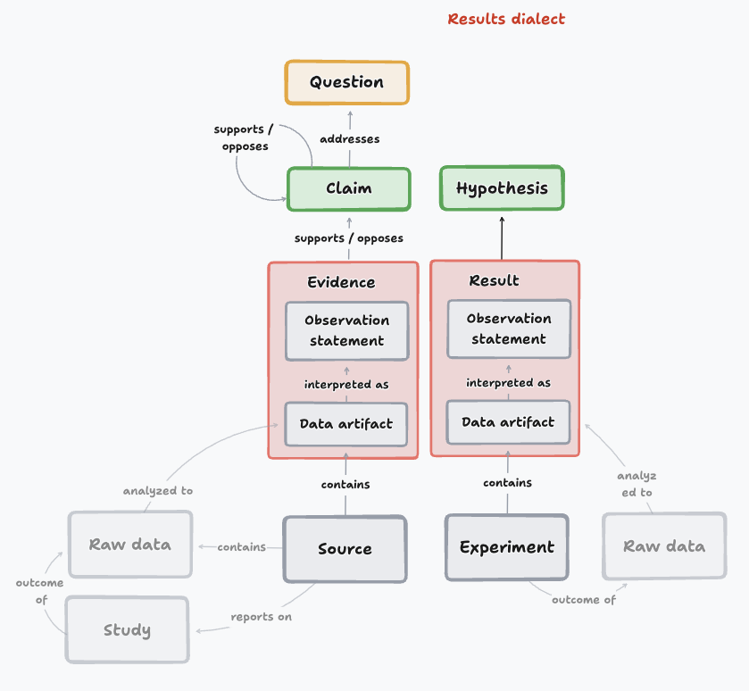
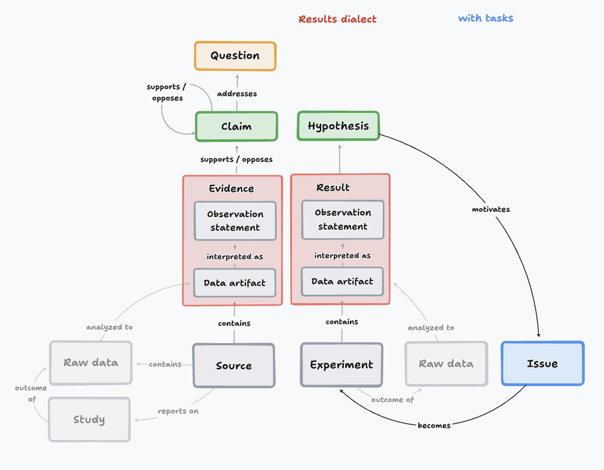
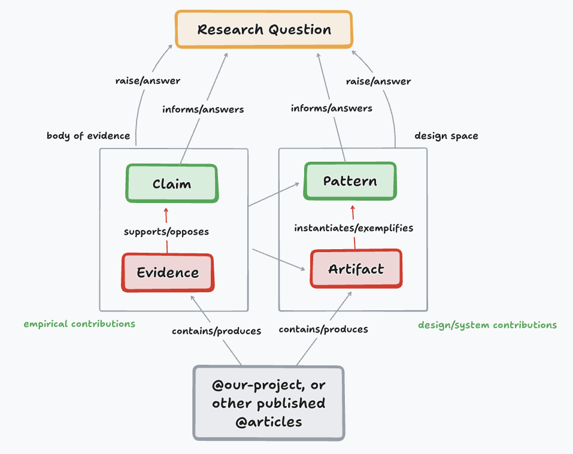
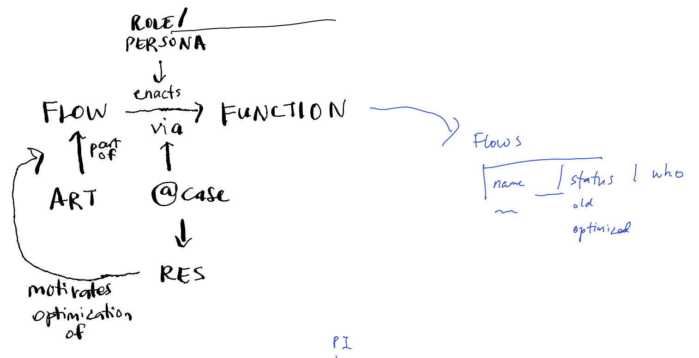
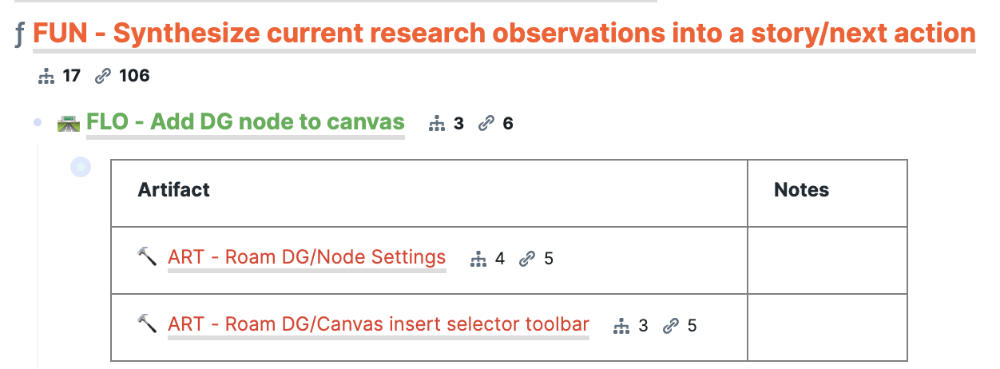
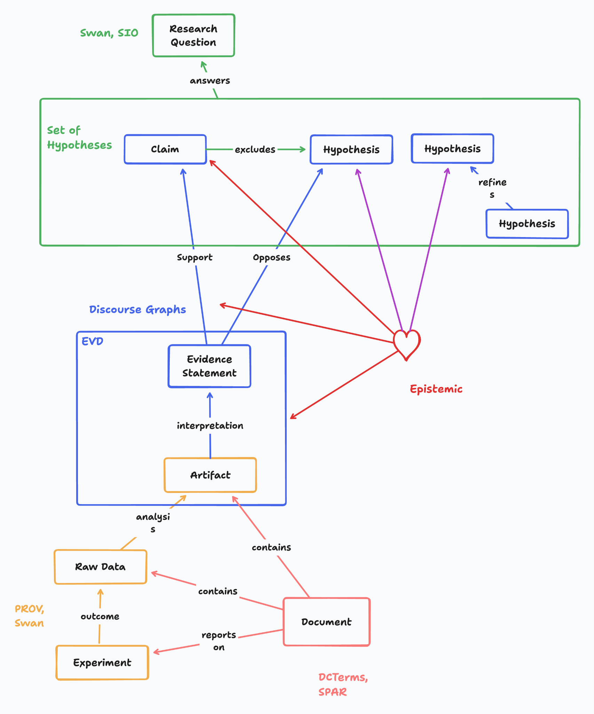

The purpose of this document is to outline a specification for using discourse graphs as an interoperable protocol and operating system for scientific research.

# Background and Motivation

Reasoning and retrieval based on *discourse* is a critical feature of scientific discovery.

Some examples:

- **Problem formulation:** When mapping out a problem space to identify opportunities for new contributions, researchers want to know the answers to questions like “What are the relevant claims of interest for my question, and what are their relative evidential weights?”, or “What results are worthwhile (e.g., supports important claims) and possible to attempt to replicate (clear inferential link between result and claim)?

- **Formulating research contributions:** When thinking through whether a given project has made a “sufficient” contribution, a scientist needs to think through what *evidence* they have generated from their experiments, and the degree to which they *warrant/support* key *claims* of interest to the community (e.g., ones that imply other interesting claims, or address important shared questions of interest).

- **Theory construction:** When constructing theories or models of a phenomenon using appropriate domain-specific representations like a causal/knowledge graph or system of differential equations, the theorist needs to ensure that the edges/paths/relations in the model (which can be formulated as a set of statements or *claims*) are sufficiently *evidenced* to warrant inclusion in the model.

The common thread across these examples is that the task is supported by operations on *discourse* units like claims and evidence (and their interrelations), in addition to domain-specific scientific entities of interest, and separately from research papers (which contain the discourse units of interest).

Unfortunately, most infrastructure and tools for sharing scientific knowledge operate on *documents* as the core unit of analysis. For instance, academic search engines primarily target retrieval of *papers* (or equivalent documents like books and book chapters or reports). Literature tools like Zotero emphasize organizing and managing documents, not discourse. This mismatch between the document-centric data model and the need for discourse creates immense overhead for scientists using existing tools and infrastructure for these core tasks.

There is now a growing number of tools and platforms[^1] (including ones we have developed and deployed in real scientific settings[^2]) that now support operations on discourse units as a first-class object. Enabling semantic interoperability between these tools has significant potential to accelerate scientific discovery by creating a new (federated) infrastructure for sharing and reusing scientific knowledge that more closely matches the actual information needs of scientists for scientific work. In short, there is a significant opportunity to enable the construction of a new infrastructure for [FAIR](http://gofair.foundation/) publication and sharing of scientific knowledge (not just data or papers). The purpose of this document is to sketch out a proposal for a conceptual and technical schema to enable this interoperability.

To be more explicit, our **guiding principles** are:

- **Balance expressivity of the semantics with simplicity/consensus across tools and research/epistemic communities**

  - This means we don't define in the common spec what is going to be (irreducibly) controversial (e.g., requiring quantitative values for support/oppose relations, or deciding on [evidence thresholds](https://roamresearch.com/#/app/discourse-graphs/page/3ehfnbIKg) or belief predicate functions that determine whether something is a claim or a hypothesis

- **Prioritize/consider pragmatics (implications for UX, in terms of costs/affordances/payoffs)**

  - One key implication is a core commitment to incremental formalization: allow discourse graph entities to be born with only the absolute minimum required formality, and progressively provide affordances (and corresponding payoffs) for adding more formal properties over time. For instance, from a UX POV, within your own lab/notes before you publish to the protocol, your "claims/hypotheses" start out default as generic superclass statement, with no explicit belief predicate, and we prompt you to, if you are able, express a belief predicate and attribute to you, at which we can resolve to one of the subclasses (HYP, CLM, etc.)

  - Another key implication is to allow for local variations in labels for key elements, to match what is most resonant and meaningful in that setting, and build affordances for translating between these local label variations when interoperating across tools. The technical schema that accompanies this conceptual proposal will be one key solution for this.

- **Enable interoperability with prior relevant standards, where possible.**

  - Our proposal synthesizes common shared features from significant prior art on discourse-centric data models[^3]. Our goal is not to replace these prior specifications, but rather to specify the *minimum possible schema* to enable interoperability amongst existing discourse-centric tools, while also describing common local variations of the schema to permit downstream development of schema translation/migration, including (where appropriate) usage of established data models.

# Conceptual specification

## Base “discourse graph” schema

The “base schema” has 4 types of nodes: 1) Questions, 2) Claims, 3) Evidence, and 4) Sources. It also has 4 types of relations: 1) Supports, 2) Opposes, 3) Addresses, and 4) Interpreted As. Together this base schema comprises what we call a **discourse graph**.

| **Node Type** | **Description** | **Example** | **Notes** |
|---------------|-----------------|-------------|-----------|
| Question | Scientific unknowns that we want to make known, and are addressable by the systematic application of research methods | What is the NPF for CLIC/GEEC endocytic scission? | |
| Claim | Atomic, generalized assertions about the world that (propose to) answer research questions | IRSp53 binds WAVE complex | |
| Evidence | A specific empirical observation from a particular application of a research method | IRSp53 coimmunoprecipitated with WAVE in NIH3T3 cell lysates | Typically written in the past tense to emphasize its contextual nature. Evidence is more like a “bundle” than a simple statement: to be more specific, it is a statement describing a specific observation from a particular application of a research method, interpreted by a researcher from one or more “data artifacts” (figures, quotes, tables, statistics), and directly linked to a description of the particular application of a research method that produced the data artifact |
| Source | Some research source that reports/generates evidence, like an experiment/study, book, conference paper, or journal article | @miki2000irsp53 | What’s important for the link to evidence is that the source describes the relevant research method application that gave rise to the data artifact(s) that are part of an evidence bundle |

| **Relation Type**        | **Sources/Targets** | **Example** | **Notes**                                   |
|--------------------------|---------------------|-------------|---------------------------------------------|
| Supports / Supported By  |                     |             |                                             |
| Opposes / Opposed By     |                     |             |                                             |
| Addresses / Addressed By |                     |             |                                             |
| InterpretedAs            |                     |             | This will probably map to the PROV ontology |

An important but possibly controversial opinion here is that **claims and evidence should be treated as separate types of things**. While both claims and evidence as defined above can be thought of as assertions or statements, in practice we have found that separating them explicitly as different types of things confers many important benefits for scientific thinking and practice. How this distinction should be modeled from a technical data structure perspective is a separate question, but we claim that **a critical portion of the benefits of a discourse-centric infrastructure and tooling system accrue from distinguishing claims and evidence (bundles) as first-class objects and should thus be preserved from a user experience perspective (regardless of how it is modeled from a technical data structure perspective).**

Examples:

- We can more naturally reason about the contributions of projects/papers in terms of the importance/novelty of their claims, relative to the rigor/trustworthiness/etc. of the empirical evidence that supports/opposes them. This enables us to more naturally assess what is known or unknown *empirically*, and what needs to be done next to increase the quality of our answers to our research questions.

- We can structure and scaffold contributions in earlier stages of scientific work: for instance, undergraduate research assistants can easily run experiments and feel comfortable reporting specific empirical evidence from those experiments, and then discuss with the lab over time what claims can be made from those evidence (and/or what additional evidence is needed to support an interesting claim).

- Starting with evidence “bundles” (by virtue of their link to the contextual details of the particular study that produced the data artifact(s) interpreted as evidence) can support more flexible and reasoned abstraction and sensemaking over collections of potentially conflicting evidence. For instance, you can choose whether you want to abstract from an evidence statement about performance of a post-training algorithm applied to the OLMO model as applying to (open weight large language models, language models in general, and so on), and also recover contextual details that might be necessary to explain conflicting evidence (e.g., context length, dataset, task).

- We can “compile” theories/models from claims in a transparent, evidence-grounded manner (choose claims that have sufficient evidence associated with them, abstract from measurements to concepts/constructs in a principled manner)

- 

## Common variations and their purposes

### Lab discourse graphs

People have used discourse graphs to track the claims and evidence in their *ongoing, unpublished* research.

In this variation, people

- label each claim as a **hypothesis** (untested claim)

- call evidence from their ongoing work a **result**.

- *Experiment*[^4] is the source material for a result.

This variation in labels fits quite naturally into ongoing research, to say, e.g., that the target “hypothesis” for an experiment is x, and that the results from these experiments, when taken together, can then be shared with the rest of the scientific community as a meaningful unit of contribution. The base schema label of “claim”, for instance, can feel awkward and too strong for early stage work, and insufficiently weighty, for a project-level conclusion/contribution.

Applying this model for ongoing research one step further, we can introduce an *issue* as a type of candidate experiment:

- **Issue**[^5] is a "future experiment" for themselves or someone else.

“Issue” closes the loop for ongoing research: the researcher wants to make a claim, but the available evidence isn’t quite strong enough, so that motivates a potential experiment. The issue, when claimed, comprises a new experiment, from which new results may be generated.

This schema may also be extended to create and link to specific node types for Methods or Protocols, or entities like Cell lines, to enable queries like “find all the evidence for claim A, and subset it by the cell line and method”, or “what methods are present in our evidence for claim A”.

### Discourse graphs and HCI

This model has also been adapted to cover the kinds of questions and contributions that constitute research in Human-Computer Interaction (HCI).

In this variation, people add node types of Patterns and Artifacts to help structure work on contributing new Design Patterns (instantiated in specific Artifacts that we can test and explore) to address "How might we" research problems in HCI.

- **Artifact**: a specific concrete system (prototype, standard, etc.) that instantiates one or more conceptual patterns or methods

- **Pattern**: a conceptual class such as a theoretical object, heuristics, design patterns and system/methodological approach, that is abstracted from a \*specific\* implementation. Patterns are what make specific systems "work" or not, matched to a model of the problem.

This model can help structure synthesizing new HCI research directions in close conversation with existing/prior work.

- For example, if we're making a systems contribution, we can review the design space / history of prior art we build on and/or contribute to, w/ something like the following structure

  - For each key \[\[PTN\]\]

    - Describe key exemplar \[\[ART\]\]s for this \[\[PTN\]\]

    - Key \[\[CLM\]\] and \[\[EVD\]\] about this \[\[PTN\]\] in relation to our core problem

    - And any open \[\[QUE\]\] we address

      - e.g., does \[\[PTN\]\] work for our task? what might the \[\[ART\]\] look like?

      - \[\[ART\]\] seems awesome, but doesn't quite do X, how do we make it do x

      - lots of people say \[\[PTN\]\] is great, but we don't have great \[\[EVD\]\] that it actually works

- Or if we're making an empirical contribution, we can review prior insights and questions we build on and/or contribute to, w/ something like the following structure

  - Key \[\[CLM\]\] about some core (sub)\[\[QUE\]\]

    - Key supporting and opposing (possibly conflicting!) \[\[EVD\]\], with intuitions about strength of \[\[EVD\]\]

    - And then any open \[\[QUE\]\] that remain that we address

      - e.g., \[\[CLM\]\] is big if true, but we really don't have good \[\[EVD\]\] for it (for our context, or bc the methods suck for XYZ reasons, etc.)

      - \[\[CLM\]\] A and \[\[CLM\]\] B are in major tension, here's what a decisive \[\[EVD\]\] would look like that arbitrates between them

As above with methods and entity types linked to the core discourse graph, this variation expresses interoperability between a discourse graph and a more domain-specific knowledge graph, where it is useful to know what claims and evidence involve or speak to domain-specific entities.

### User experience research

# Technical instantiations

We are developing a set of technical instantiations of this conceptual schema that enable specific tools and transport layers to express the schema. This is very much a work in progress: unless otherwise noted, all links below are to proof-of-concept, early-stage drafts whose purpose is to stimulate discussion and iteration, rather than support real-world usage.

Some notes on key design choices we think should constrain implementations:

1.  **Where possible, local variations in labels/subtypes for a node type (e.g., conclusions, claims, hypotheses) should point to the nearest base schema node type for the purposes of interoperability.**

2.  **Relations should be separate assertions (with their own metadata) rather than attributes of a discourse node.** In other words, all relations should be reified.

### OWL

See [owl/](owl/) for the OWL ontology files: [dg_core.ttl](owl/dg_core.ttl) and [dg_base.ttl](owl/dg_base.ttl).

Will eventually be hosted on [Nanodash](https://nanodash.knowledgepixels.com/explore?26&id=https://w3id.org/np/RAoRxaHtG1GTAjqV5LZAv4lzIuCLnowJe-3GeTFjLcq5Y&label=The+Discourse+Graphs+project&forward-to-part=true).

The purpose of this spec will be to define the minimal shared based set of nodes and relations across the discourse graph protocol. At the moment, the draft defines specs for the "Base “discourse graph” schema" as defined above.

This spec will also explicitly map the node and relation types to pre-existing schemas from the Semantic Web, such as [SEPIO](https://va-spec.ga4gh.org/en/latest/appendices/sepio-framework.html), [micropublications](https://link.springer.com/article/10.1186/2041-1480-5-28), and [ScholOnto](https://research-archive.stem.open.ac.uk/scholonto/), as appropriate, to enable interoperability.

We assert that a tool has a discourse graph and can productively interoperate on the protocol if it contains data structures that can be mapped to these base nodes and relations.

### ATProto Lexicon

See [atproto-lexicon/](atproto-lexicon/) for a prototype ATProto Lexicon (`org.discoursegraphs.*`) that maps the base discourse graph schema to federated ATProto records. Relations are reified as separate records with their own authorship, provenance, and timestamps, enabling a tiered trust model from personal graphs to cross-community federation.

### JSON-LD

Example: https://github.com/DiscourseGraphs/MATSUlab-issue-exchange-analysis

Useful for MCP servers, and for interoperation between ATProto and the semantic web (e.g., nanopublications.)

### MyST AST

See [discourse-graphs-myst-spec.md](discourse-graphs-myst-spec.md) for a draft specification of MyST Markdown directives and roles that embed discourse graph semantics directly into scientific documents, enabling continuous lab workflows and cross-lab collaboration.

### OXA

Forthcoming!

[^1]: A non-exhaustive current list includes [Fylo](https://fylo.io/), [Oshima](https://oshimascience.com/), [Octopus](https://www.octopus.ac/), [Nanodash](https://nanodash.knowledgepixels.com/?30), [Polyplexus](https://start.polyplexus.com/), [CIVICDB](https://civicdb.org/welcome), and [Consensus](https://consensus.app/)

[^2]: [https://discoursegraphs.com/](https://discoursegraphs.com/)

[^3]: A non-exhaustive list includes the [ScholOnto](https://research-archive.stem.open.ac.uk/scholonto/) project, [micropublications](https://link.springer.com/article/10.1186/2041-1480-5-28), [nanopublications](https://nanopub.net/), and [SEPIO](https://va-spec.ga4gh.org/en/latest/appendices/sepio-framework.html)

[^4]: Here, we use the term “experiment” to denote a specific set of systematic methods applied to answer a specific question or hypothesis, that will then produce data that can ground a result or evidence (specific observation). It’s therefore a more expansive conceptual unit that can refer to many different kinds of systematic studies using a variety of methods, such as simulations, analyses, surveys, etc. The main goal is to distinguish this entity from “data” (some files, numbers, etc. that came from an experiment). We encourage local discourse graphs that wish to operate on the protocol but disfavor this specific term to still use the entity (via URI) and apply a label that makes more sense in their local context.

[^5]: Note: the term “issue” is up for debate - it has proven useful in practice, but also can sometimes be confused for a more generic “task” or “problem to be solved” (in the IBIS sense). Tools and users should feel free to use a label that more accurately and resonantly captures the core idea of an issue as a *request for an experiment/study* (that someone could claim and produce results that support/oppose a hypothesis).
